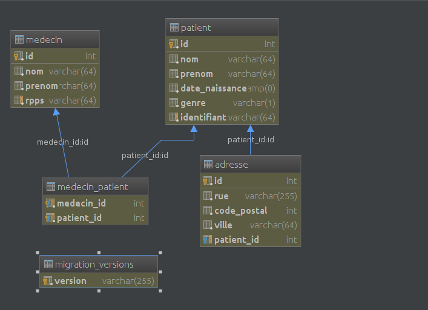
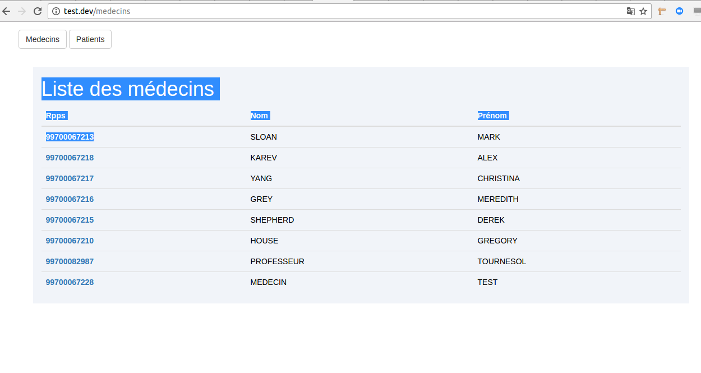

# Test Symfony

## Introduction
>HL7 est un standard international pour les échanges informatisés de données cliniques, financières et administratives entre systèmes d'information hospitaliers (SIH).
HL7 v2.5

Les messages HL7 v2.x utilise une syntaxe basée sur des segments (lignes) et des délimiteurs de 1 seul caractère. Les segments ont des champs séparés par le délimiteur de champs (‘|’). Les champs peuvent avoir des sous-champs (composants) séparés par le délimiteur de composants (‘^’) et les composants peuvent avoir des sous-composants séparés par le délimiteur de sous-champ (‘&’).   
Chaque segment commence par une chaîne de 3 caractères identifiant le type du segment. Chaque segment contient une catégorie spécifique d’information. Chaque message commence par un segment MSH (Message Header) qui identifie le type du message. Le type du message détermine les informations qui seront présentes dans le message.  

**Messages HL7 ADT**  
Les messages HL7 ADT (Admit Discharge Transfer) véhicule les informations administrative du patient ainsi ques les mouvements du patient au sein de l’hôpital.  
Les messages HL7 ADT fournissent notamment des informations au sujet du patient et du médecin traitant du patient.
Les informations du patient sont largement contenues dans le segment PID (Patient Identification). Par exemple son nom de famille se trouve dans le segment PID, champ 5, composant 1. La notation raccourcie pour cette information est PID-5.1. 
Les informations utiles du patient sont :

**Nom :** PID-5.1  
**Prénom :** PID-5.2  
**Date de naissance :** PID-7  
**Genre :** PID-8  
**Adresse**  
**Rue :** PID-11.1  
**Code postal :** PID-11.5  
**Ville :** PID-11.3

Les informations du médecin traitant du patient sont contenues dans le segment ROL (Role) :  
**Nom :** ROL-4.2  
**Prénom :** ROL-4.3  
**RPPS :** ROL-4.1 si ROL-4.13 = ‘RPPS’  

>Le RPPS est le numéro d’identification unique des médecins au Répertoire Partagé des Professionnels de Santé
Exemple

*Exemple de message*
```
MSH|^~\&|ASOL|SOL|ENOVACOM|HL7|20150528100134||ADT^A08|1306364|P|2.3.1||||||8859/1
EVN|A08|20150409000000||||201504090000
PID|||7315431^^^ASOL^PI||FEDERER^ROGER^^^^^L||19810808|M|||55 RUE DU MARECHAL LECLERC^^SAINT MAURICE^^94410^100^H~^^TORNO DO PINHA^^^139^BDL||0179560405^PRN^PH||FR|S||815034840^^^ASOL|1810845125532 45|||||||100||||N
PV1||I|1211^S225^1|R||||||A01||||||F|RCAUSSE||815034840^^^ASOL|||||||||||||||||||||||||20150508174100|||0|||1|A
PV2|||^^^CONS
ROL|1|UP|ODRP|99700067210^MEDECIN^TRAITANT^^^^^^AGFA^^^^RPPS|19000101|29991231
ZFU|||1163|20150522181500|1162|20150522181500
```
Le message ci-dessus contient les informations suivantes : 
#### Patient
**Nom :** Federer  
**Prénom :** Roger  
**Date de naissance :** 08/08/1981  
**Genre :** Masculin  
**Adresse :**  
**Rue :** 55 rue du Marechal Leclerc  
**Code postal :** 94410  
**Ville :** Saint Maurice  
#### Médecin
**Nom :** Medecin  
**Prénom :** Traitant  
**RPPS :** 99700067210  

## Exercice
Parser les données HL7 et les insérer en base:

* Forker ce repo GIT sur votre Gitlab/Github
* Créer les entités nécessaires au projet
* Parser les fichiers HL7 présent dans `web/files/` à l’aide de PHP/Symfony
* Insérer les entités générées en base de données.

## Important
* Faire une interface web est un plus mais c'est FACULTATIF, plus vous livrez vite et bien, mieux c'est !
* Soigner votre code
* Modifier ce readme dans votre repo pour expliquer votre projet.
* Envoyer le lien github/gitlab de votre projet afin que l'on puisse regarder votre code.

## Explication du test

#### Introduction

Pour la réalisation du test,  j'ai installer le bundles doctrine migrations. 
La base de données est du PostgreSql.

Les données HL7 sont récuperer par une commande symfony. Dans l'IHM, on a peut afficher la liste des médecins et celle des patients.

Pour chaque médecin, on peut voir ses patients et pour chaque patient on a la possibilité de voir ses médecins traitant.


#### Modèle
Voici le modèle de données:


Un médecin peut avoir plusieurs patients et un patient plusieurs médecins traitants.

Un patient peut avoir plusieurs adresses.

#### Récupèrer le projet sur github

Pour récuperer les source, il suffit de faire la commande suivante depuis le repertoire de travaille:
git clone https://github.com/dioppape/test-symfony.git

#### Configuration du l'application
Vu que le fichier parameter.yml n'est pas versionné, les paramêtre par defaut sont sur le fichier parameter.yml.dist.
Il faut configurer les paramêtres de la base de données postgreSql et le dossier `web/files/` contenant les fichiers HL7.

#### Execute du script deploy.sh
Le script deploy.sh excute les taches suivantes:
Apès l'installation de l'ensemble des packages avec la commande
>composer install

et la réation de la base de données
> php app/console doctrine:database:create
Lancer le script ./deploy.sh qui se de charge:
* Création/mise à jour des tablesdes tables avec doctrine migrations
> php app/console doctrine:migrations:migrate -n
* Vider les données HL7 avec la commande
>php app/console import:adt --truncate
* Importation des données HL7 avec la commande
>php app/console import:adt --force

#### Demarrage de l'applcation
url-de-base




